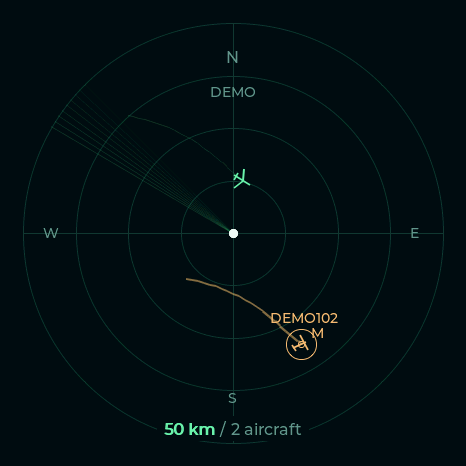

# EchoScope

*A miniature radar station for the aircraft overhead.*



A live aircraft radar for the **VIEWE UEDX46460015-MD50ET** rotary touchscreen: an ESP32-S3 with a 1.5-inch round AMOLED, touch input, encoder and push button.

Aircraft data is supplied by [adsb.fi](https://adsb.fi/) over Wi-Fi. No ADS-B receiver is required. A labelled demo is available before configuration.

## Features

- North-up radar centred on your location, with 5 / 10 / 25 / 50 / 100 km ranges.
- Rotate to zoom or select aircraft; a bare knob press toggles the mode.
- Bold, brighter footer text shows what rotation controls.
- Touch an aircraft to see callsign, registration, type, altitude, ground speed, ground track, distance, bearing and position age where available.
- Faint altitude-coloured flight paths, with the selected path highlighted in amber above other paths.
- N/E/S/W compass labels and a decorative radar sweep.
- Local Wi-Fi/location setup, saved settings, stale-data indication and reconnection handling.

Latest firmware: **0.2.3**. It includes the two-transitions-per-detent adjustment for one action per physical click.

## Hardware status

The user has confirmed working display, Wi-Fi, live aircraft retrieval, touch/details and rotary input on the VIEWE device. Version 0.1.3 fixed the observed TLS stalls by separating network and display work across CPU cores. Versions 0.2.1–0.2.2 compile successfully; the latest detent adjustment, selected trail styling and compass additions still need confirmation on the physical device. Host interaction tests and actual LVGL screen rendering are documented in [VALIDATION.md](VALIDATION.md).

## Controls

| Input | Radar view | Flight details |
|---|---|---|
| Rotate | Zoom, cycle visible aircraft or choose an altitude band | Cycle visible aircraft |
| Press without touching the screen | Cycle range → aircraft → altitude mode | Return to radar, preserving the mode |
| Touch an aircraft | Select it and open details | Tap to return to radar |
| Touch blank radar space | Open the highlighted aircraft | Tap to return to radar |
| Tap bottom range / aircraft count / ALT | Select the corresponding rotation mode | — |
| Hold knob 5 seconds | Open Wi-Fi/location setup | Open Wi-Fi/location setup |

The active footer section is bold and brighter: **50 km** for zoom, **2 planes** for selection, or **ALT** for altitude filtering. Touch and mechanical-click events are combined into one gesture, so pressing the screen does not immediately undo the touch action. A bare click is deferred by 180 ms to allow touch detection.

## First installation

The target has an **ESP32-S3, 16 MB flash and 8 MB OPI PSRAM**. Use the existing ribbon/USB adapter. Its jumper functions have not been verified here.

Run `make setup` to install the local tools. If desired, preserve the factory firmware before uploading:

```sh
.tools/venv/bin/python -m esptool --chip esp32s3 --port /dev/ttyACM0 read_flash 0x0 0x1000000 factory-backup.bin
```

Build with `make firmware` or download the release assets first. With the device in upload mode, write the merged image at **0x0**:

```sh
.tools/venv/bin/python -m esptool --chip esp32s3 --port /dev/ttyACM0 write_flash 0x0 dist/echoscope-merged.bin
```

Use the serial port your device exposes. The commands use esptool 4.x syntax. Restart normally without holding BOOT after flashing.

1. Join **EchoScope-Setup** using the randomly generated Wi-Fi password displayed on the knob.
2. Open **http://192.168.4.1**.
3. Enter your 2.4 GHz Wi-Fi credentials and the decimal latitude/longitude at the centre of your radar. West and south use negative coordinates.
4. Save. The device connects, synchronises its clock and starts retrieving aircraft.

Before saving settings, press/tap to explore the labelled demo, then hold the knob to return to setup. Demo aircraft are never substituted for live aircraft after setup. Credentials and location stay in device storage; location is sent to adsb.fi to request nearby aircraft. The setup form never displays the saved Wi-Fi password. A blank password preserves it when retaining the same SSID.

When connected, holding the knob opens setup showing your configured SSID and LAN IP; browse to that IP from the same network. The EchoScope-Setup access point is off while connected. If the configured network is unavailable for 30 seconds, the fallback access point starts and setup shows its credentials/address instead. Opening setup manually while disconnected also starts it. Reconnecting shuts the access point down automatically. Setup access closes five minutes after being opened if Wi-Fi is connected. A failed connection leaves recovery setup available. Holding the knob reopens it. Range starts at the configured startup range after reboot; rotation mode resets. Wi-Fi and location persist.

## Updating an existing installation

Flash the application-only image at **0x10000**, retaining Wi-Fi and location:

```sh
.tools/venv/bin/python -m esptool --chip esp32s3 --port /dev/ttyACM0 write_flash 0x10000 dist/echoscope-app-0.2.3.bin
```

This offset assumes an existing EchoScope installation with this project's partition layout. The merged image spans the settings partition; use it for first installation, not a settings-preserving update. Firmware checksums are in `dist/SHA256SUMS`.

## Build from source

Prerequisites: Linux/macOS, Python 3.10 or newer with `venv` and pip, GNU Make, Git and a C++17 compiler (g++/clang++ for host tests). On Windows, use WSL for builds or PlatformIO directly; USB access needs separate configuration. The Makefile creates its Python environment and PlatformIO toolchain under `.tools/` in the project; it does not install packages system-wide.

```sh
git clone https://github.com/MrPsyware/echoscope.git
cd echoscope
make setup
make test
make firmware
```

Firmware images and checksums appear in `dist/`. After entering upload mode:

```sh
make backup PORT=/dev/ttyACM0       # optional: preserves a full 16 MB flash copy
make flash-full PORT=/dev/ttyACM0   # first installation only
# OR, for updates to an existing installation:
make upload PORT=/dev/ttyACM0       # writes only the application, retaining settings
make monitor PORT=/dev/ttyACM0
```

Run `make help` for all commands, including `deps`, `build`, `ports` and `clean`. `clean` keeps downloaded tools and backups. You can override `PYTHON`, `CXX`, `PORT`, `BAUD` and `PLATFORMIO_CORE_DIR`. Use `make -j` only for a single target; operations that share PlatformIO's build directory should not be run simultaneously.

Prebuilt images are available from [GitHub Releases](https://github.com/MrPsyware/echoscope/releases). The older project name was Sky Knob; its NVS storage namespace is intentionally retained for settings compatibility. The setup Wi-Fi is now **EchoScope-Setup**.

The first build downloads the toolchain. Dependencies are pinned in `platformio.ini`: Arduino-ESP32 3.1.1 through PioArduino, Espressif Display Panel 1.0.3 and LVGL 8.4.0, among others.

The supported `BOARD_VIEWE_UEDX46460015_MD50ET` definition is used. Its touch wiring differs from the manufacturer's README table:

- Encoder A/B: GPIO6 / GPIO5. Push button: GPIO0. Two transitions per detent.
- Driver touch configuration: SDA GPIO1 / SCL GPIO3, CST820.
- CO5300 QSPI display: GPIO12 CS, GPIO10 clock, GPIO13/11/14/9 data, GPIO8 reset and GPIO17 power.
- Driver resolution: 472 × 466; the round 466 × 466 interface is centred within it. RGB565 byte swapping is enabled.
- Network/Arduino task: CPU core 0. LVGL: core 1. Render period adapts to leave at least 50 ms after drawing, with a maximum of five frames per second.

## Aircraft and trails

Up to 64 valid airborne aircraft within 100 km are retained, prioritising watchlist matches and then nearest distance. Rotation skips aircraft outside the current visible range. Selection follows aircraft identity across updates. Unknown fields are shown as unavailable; origin/destination lookups are not implemented.

Trails retain the path while the aircraft remains visible and fresh. They clear when the aircraft disappears, exits the current range (including after zooming), or its position ages past 60 seconds. Re-entry starts a new history. The start of the encounter is preserved while older geometry is simplified when the bounded 192-point history fills. Straight sections are simplified within a 20-metre tolerance. Histories are stored in PSRAM and clipped at the radar boundary.

The sweep is decorative: aircraft are shown at their last reported positions, without extrapolation. Coverage depends on the feed's receivers.

## Networking and diagnostics

Aircraft are requested from `https://opendata.adsb.fi/api/v3/lat/{lat}/lon/{lon}/dist/54`. Polling waits five seconds after a successful request; failures back off up to two minutes. HTTP 429 waits two minutes. An empty successful feed clears the list; a failed request retains the ageing snapshot. Positions dim after 20 seconds and disappear from the radar after 60 seconds.

HTTPS verifies the hostname and certificate using Google Trust Services Roots R1 and R4. A valid clock is required. The pinned TLS client advertises HTTP/1.1 and an ECDHE AES-GCM cipher set. On the first failed feed connection per boot, it tests a verified TLS handshake to `pki.goog`, without sending an HTTP request or location data. Serial logs include network, TLS, task and rendering diagnostics.

The currently pinned Arduino core can emit `Bad file number` messages even while verified TLS and live updates succeed. These messages remain an unresolved client-integration issue; inspect the `[network]` and `[tls]` results rather than assuming every such line represents a failed fetch.

Use the [adsb.fi public API](https://github.com/adsbfi/opendata) in accordance with its personal/non-commercial terms and rate limits. API access is not guaranteed.

## Host tests and CI

`make test` compiles and runs the model/input and JSON tests on the host. They cover projection, range and selection behaviour, touch/button arbitration, history cleanup and clipping, JSON validation and capacity bounds. `make firmware` validates the generated application partition offset before merging images.

GitHub Actions runs setup, host tests and a complete firmware build on pushes and pull requests, and stores firmware as a downloadable workflow artifact. See [VALIDATION.md](VALIDATION.md) for prior checks and hardware limitations.

## Printable enclosure

A vintage radar-station-style 3D-printed enclosure is planned. CAD/STL files and assembly instructions will be added when available; they are not included yet.

## Credits and licence

This is a new application inspired by [MatixYo/ESP32-Plane-Radar](https://github.com/MatixYo/ESP32-Plane-Radar). Hardware support comes from the [VIEWE examples](https://github.com/VIEWESMART/UEDX46460015-MD50ESP32-1.5inch-Touch-Knob-Display) and Espressif libraries.

Original application code is MIT licensed. See [LICENSE](LICENSE) and [THIRD_PARTY.md](THIRD_PARTY.md) for component attribution and licences.

### Feed diagnostics

Run `make monitor PORT=/dev/ttyACM0` to see each request's HTTP status, response byte count (`-1` means unknown advertised length), read timing, parsed/retained aircraft counts and retry delay. Failures also report the exact ArduinoJson decoder error or missing `ac` array, incomplete-body reason, selected response headers (including `Retry-After` and `CF-Ray` when present), memory and Wi-Fi state, and at most 240 characters of the response prefix. Remote text is flattened to printable single-line text. Error-body reads are limited to 1 KiB/one second; successful-response reads to 512 KiB/eight seconds. Repeated failures are logged even when the screen status has not changed.

Capture the complete `[feed]` block around a failure to distinguish an API error page, rate limit, truncated transfer or memory issue. A prefix can contain aircraft positions returned by the public feed. The radar zoom changes the display only; requests always use the saved home latitude/longitude and `/dist/54`.

Version 0.2.5 also logs the approximate zero-based parser stopping offset, a 200-character context window, up to 33 hexadecimal bytes around the stop, and the last 200 response characters. Capture these lines with the failure headers. For a response without Content-Length, `transport ended=yes` only means the connection closed; JSON parsing must still succeed.

Version 0.2.6 fixes large-response corruption in the pinned Arduino core by accumulating response bytes in a fixed-capacity PSRAM buffer instead of growing an Arduino String. The successful-response buffer is 512 KiB, freed after each request. JSON failure diagnostics remain enabled.

Version 0.2.7 samples the mechanical button in a separate task every roughly 5 ms, with 30 ms debounce, so a radar render cannot hide a short press. Timestamped button events are handled by the UI; touch overlap suppression and the five-second setup hold remain. Serial `[input]` lines show releases, touch overlap and accepted clicks.

### Aircraft classes and filters (0.2.8)

Tap the top radar label to cycle **All → Military → Rotorcraft**. Filtering applies to symbols, trails, hit testing and knob selection. A new feed request refills the nearest 64 matching aircraft; the display can be empty briefly while it arrives. Military is the database flag (`dbFlags & 1`), not an inference from callsign or tracking source. Missing tags do not prove civilian status.

Aircraft use light/large fixed-wing or rotorcraft symbols when classified; unknown classes use a diamond. Classification uses emitter category with a small model-code fallback for common rotorcraft. The independent **M** badge marks military-tagged aircraft. Selected symbols and trails stay orange. Full model descriptions appear on the details screen when supplied.

The radar radius is now 200 pixels (previously 182). Normal live operation has no persistent status banner; stale/error messages remain and adsb.fi attribution appears on the details screen.

### Auto-hide and standby (0.2.9)

After 10 seconds without touching the screen, the filter disappears and reveals the north marker. Its touch area stays at the top: the first tap reveals the current filter; later taps cycle it. Touching the screen extends its visible period, while turning/pressing the knob does not reveal a hidden filter.

After the configured idle period (one hour by default) without touch, press or rotation, the panel turns off and radar rendering and new HTTP feed requests pause. An already-running request may finish. Touch/knob sensing and Wi-Fi remain active; this is display standby, not ESP32 deep sleep. The first interaction wakes the display without changing settings or selection, and requests fresh aircraft data. Serial `[power]` messages mark sleep and wake.

### Optional aircraft photos (0.3.0)

The [information server](info-service/README.md) runs in Docker on another LAN computer. Start it with `make docker` from the repository root (listens on `0.0.0.0:8086`), then hold the knob for 5 seconds to unlock its web setup. Enter `http://YOUR-SERVER-IP:8086` in **Info server URL**, test and save. Leaving it blank disables photos.

Aircraft details automatically request the actual aircraft's thumbnail by registration when photos are enabled. The same page shows aircraft type, altitude, speed, distance/bearing, track and position age alongside the photo. Turn to select another flight; tap or press to return to radar. Photos retain photographer credit; open `http://KNOB-IP/photo` for the original-photo link. The service does not store photographs on disk. Missing photos and unavailable servers leave the radar usable. New photo requests pause during standby, and obsolete responses are discarded. The firmware accepts only the bounded image protocol; it does not decode JPEGs. See the service README for deployment, provider and protocol details.

The radar radius is now 210 pixels.


### Altitude colours and watchlists (0.4.0)

Bare clicks cycle **Range → Aircraft → Altitude → Range**. In altitude mode, rotation cycles All, below 5,000 ft, 5,000–14,999 ft, 15,000–29,999 ft, 30,000 ft and above, and unknown altitude. The selected band remains active when changing rotation mode. Filtering happens before the 64-aircraft capacity limit. Range, aircraft-class and altitude filters combine.

Aircraft and their trails use green below 5,000 ft, cyan below 15,000 ft, blue below 30,000 ft and purple above; unknown altitude is muted. The selected aircraft and trail remain orange. Stale unselected symbols are muted. Altitude is reported barometric altitude, falling back to geometric altitude when unavailable.

Hold for five seconds and open the displayed setup address to configure:

- **Brightness:** 5–100%, saved and restored after wake/reboot.
- **Idle sleep:** 0–1,440 whole minutes; 0 disables automatic sleep.
- **Watchlists:** comma/space-separated types, registrations and callsigns, up to 16 entries per field. Matching ignores case; a trailing `*` matches a prefix (`B74*`, `RCH*`). `A380` also matches the ICAO `A388` code. Other type entries use feed type codes.
- **Military/helicopter watches:** optional category switches; classifications depend on the feed's metadata.

Visible watch matches have a small category-coloured ring. The configurable outer ring activates while any matching aircraft has a position no older than 20 seconds. Alerts respect the selected range and filters, stop when positions age or leave coverage, and never trigger for demo data. Watch matches receive priority when retaining the nearest 64 matching aircraft. Monitoring pauses during sleep; alerts do not wake the screen. Saved watch rules and display settings survive reboot. Flight details still open by touch and return with a click/tap.

Space-station predictions are available through the optional information server; they use a separate orbital feed from aircraft data.


### Wireless updates and network monitoring (0.5.0)

Install this version once over USB with `make upload PORT=/dev/ttyACM0`. The existing 16 MB flash layout already contains two 6.25 MiB application slots, so no repartitioning or settings reset is needed.

For later wireless updates, hold the knob for five seconds to unlock setup, then run from your checkout:

```sh
make upload IP=192.168.2.151
make monitor IP=192.168.2.151
```

Upload builds the application, verifies the target protocol and available partition size, and sends it to the inactive slot over local HTTP. The device checks the ESP32-S3 application header, exact byte count and MD5 checksum before selecting the new firmware and rebooting. Interrupted or invalid transfers do not select the incomplete image. A syntactically valid firmware with a runtime bug is not automatically rolled back; keep USB available for recovery. Physical setup unlock is required for every upload session (the existing five-minute window). If the build takes longer, hold again and retry. Only upload trusted EchoScope application firmware, never a merged image. This LAN service is not intended for Internet exposure.

Network monitoring is read-only and does not need setup unlocked. It replays up to 8 KiB of recent application diagnostics, then polls for new logs; it reconnects after Wi-Fi loss/reboot and reports overwritten log data. Feed, TLS, input, power and display diagnostics are included. ROM/bootloader, panic output and Arduino/SDK internal logs still require USB. Feed requests can delay log delivery because the HTTP server shares the network loop. Monitoring does not wake the display; sleep still pauses aircraft requests.

Omit `IP` to retain USB upload/monitoring. USB app upload also resets OTA selection to app0, so it works after previous wireless updates while preserving Wi-Fi/location/watchlist settings. Docker is not involved. Dotted IPv4 addresses are preferred; commas are normalized for convenience.


### Alert appearance (0.5.1)

Web setup now has an **Alert appearance** section. Set separate colours for ordinary watchlist matches, helicopters and military aircraft. Colours apply to the outer ring and the small watch markers; aircraft altitude colours and orange selection remain unchanged. Military classification takes precedence over helicopter classification, including for aircraft matched by a type/registration/callsign rule. When multiple categories are visible, the outer ring uses military first, then helicopters, then ordinary watch matches.

The new defaults are a **30% peak brightness, 3-pixel ring and a gentle 4-second pulse**. Ordinary watches are green, helicopters cyan and military purple. The gentle pulse fades smoothly from 10% of the chosen peak up to the peak and back, instead of switching fully on/off. Controls are:

- Ring brightness: 0–100%, relative to the overall display brightness; 0 hides the outer ring.
- Ring width: 1–8 pixels.
- Pulse/flash period: 2–12 whole seconds per cycle.
- Effect: Off, Steady, Gentle pulse or Flash. Off leaves the small aircraft markers visible.

Appearance settings persist across reboot. Hold five seconds to unlock setup, open the displayed address, adjust and save. Existing watch rules and display settings are retained when upgrading.


### Startup range and optional information server (0.6.0)

Set **Startup range** in web setup to 5, 10, 25, 50 or 100 km. The default remains 25 km until changed; normal knob rotation does not overwrite the saved startup choice.

The Docker companion is now **EchoScope Info Server**. Update it with `git pull` and `make docker` on your server, then update the knob firmware. The existing server URL and port work unchanged. See [server setup, sources and options](info-service/README.md).

The server advertises available photos, maps and space-station predictions. Absent features disappear automatically. Flight details use their full text layout until a matching photo has loaded successfully. A faint, range-matched OpenStreetMap background includes visible attribution; a background toggle appears in setup when supported. The **INFO >** radar menu offers a separate station sky view only when the server has fresh orbital data. Rotate to choose ISS/Tiangong; tap or press to return. Pass times use UTC and a 10° elevation threshold; predictions do not imply naked-eye visibility.

The former `photo-service/` directory is now `info-service/`; `make docker` handles it. The Compose project/service IDs remain unchanged for in-place upgrades. `INFO_PORT` is the new port override; `PHOTO_PORT` still works. No external server is required for the aircraft radar.

### Family flights and weather (0.7.0)

Update both the information server (`git pull` then `make docker`) and the knob firmware. Tap **INFO >** on the radar, rotate to choose a feature and press to open it. Rotate through pages; press to return to the menu, then tap its bottom area to return to the radar. Unavailable features are hidden. Space stations retain their existing rotate-to-select controls and tap/press returns to the radar.

In web setup, **Family flight** appears after the server advertises flight support (allow up to a minute after adding/changing the server URL). Enter a flight number, an optional actual callsign override and an arrival airport such as `LGW` or `EGKK` for Gatwick. Leave the flight number blank to hide this menu item. An easyJet booking number can differ from its transmitted `EZY`/`EJU`/`EZS` callsign: the free route database tries to resolve it, but an override may be needed. The example `U2123` is only a format example, not a Gatwick flight recommendation.

Family tracking requests the specific callsign independently of the local radar range. It shows fresh position coordinates, registration/type, altitude, speed and direct distance to the configured airport when the airport index knows it. Missing coverage does **not** mean landed. Duplicate callsigns are reported instead of choosing an arbitrary aircraft. Routes are database information, not confirmed current operational routes; a mismatch with your arrival airport is flagged. Check the date and flight with the airline. This free version has no scheduled/estimated arrival, delay, gate or terminal information. It refreshes about every 20 seconds while that page is open; it is not a background arrival notification service. Existing watchlists continue to apply to local radar aircraft.

**Weather / clouds** shows local temperature, wind and cloud cover, followed by forecasts at three-hour intervals over the next 24 hours. Turn through total/low/mid/high cloud cover, rain probability and day/night labels. Times include the date and use UTC. These are forecast model values; cloud cover alone does not indicate astronomical seeing, transparency, moonlight or light pollution. Data refreshes every 15 minutes while viewing the page.

**Nearby airports** lists the five nearest airports/airfields from the cached OurAirports index. **Selected flight route** shows the database origin and destination for the radar's highlighted callsign. These features are optional and run through the Docker server. The knob keeps at most nine compact text pages and rejects oversized responses. Information fetching pauses during screen sleep; stale family positions are hidden.

Sources: [adsb.fi](https://github.com/adsbfi/opendata), [adsbdb](https://www.adsbdb.com/), [Open-Meteo](https://open-meteo.com/) (CC BY 4.0), and [OurAirports](https://ourairports.com/data/) (public domain). The free adsb.fi and Open-Meteo services are intended for personal/non-commercial use under their respective terms.
